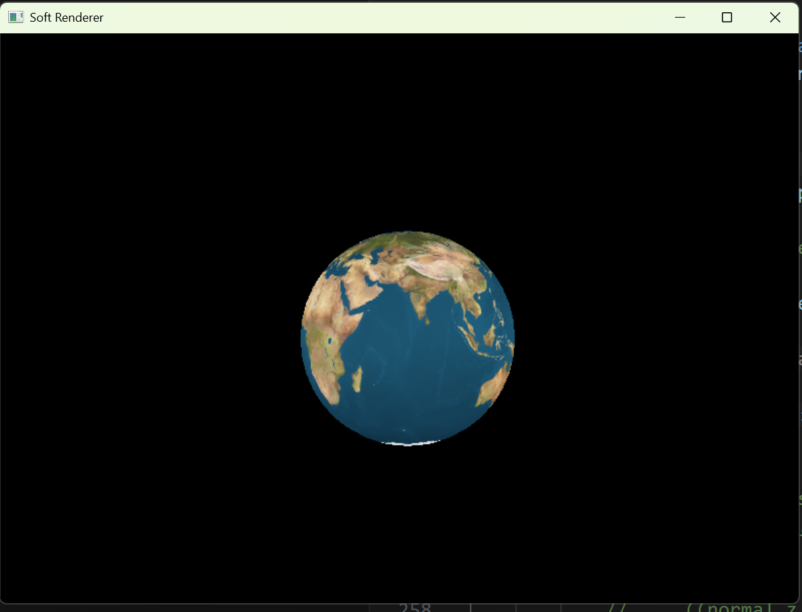

# Rust Soft Renderer

A very simple software rasterizer written in Rust from scratch, targeting Windows via Win32 API. No GPU APIs are used — the entire rendering pipeline runs on the CPU and outputs directly to a DIB (Device Independent Bitmap) framebuffer.


*(Current output: Perspective-correct texture mapping applied to a 3D sphere)*

## Features

- Complete rendering pipeline: model space → world space → view space → clip space → NDC → screen space
- Perspective-correct attribute interpolation (texcoords, normals, world position) with bilinear texture sampling
- Per-pixel depth test and backface culling
- Custom matrix and vector math library
- Binary mesh loading (`.lhsm` self-made format)
- Texture loading via the `image` crate
- Real-time camera movement (WASD / QE) with delta-time

## Conventions

These conventions are defined and implemented from scratch throughout the codebase.

### Coordinate System

- **Right-handed coordinate system**: X right, Y up, Z toward the viewer (out of screen)
- Camera looks toward **-Z** in both world space and view space

### Matrix Convention

- **Row-major storage**: `m[row][col]`
- **Row vector × matrix** multiplication: `v' = v * M`
- Transformation order: `position_cs = position_ms * model * view * projection`
- Translation is stored in the **last row** (`m[3][0]`, `m[3][1]`, `m[3][2]`), matching DirectX / HLSL convention

```
Matrix layout:
[ m[0][0]  m[0][1]  m[0][2]  m[0][3] ]   // row 0
[ m[1][0]  m[1][1]  m[1][2]  m[1][3] ]   // row 1
[ m[2][0]  m[2][1]  m[2][2]  m[2][3] ]   // row 2
[ tx       ty       tz       1       ]   // row 3: translation
```

### NDC Space

- Range: **[-1, 1]** on all three axes (OpenGL convention)
- Z range: **[-1, 1]**, where -1 is near plane and +1 is far plane — **not** [0, 1]
- Perspective projection uses the OpenGL-style formula: `m[2][3] = -1`

### Screen Space

- Origin at **top-left** corner, matching Windows DIB with negative `biHeight`
- X increases rightward, Y increases downward
- Pixel range: `[0, width-1] × [0, height-1]`
- NDC → screen space transform: `screen_x = (ndc_x * 0.5 + 0.5) * (width - 1)`

### Depth Buffer

- Initialized to `1.0` (far), depth test passes if `new_depth <= stored_depth`
- Depth values stored in NDC Z range `[-1, 1]`; smaller values are closer to camera

### Winding Order

- Input mesh uses **clockwise (CW)** winding order
- Handled by swapping `in_b` / `in_c` parameter order in `compute_barycentric_coords` — no vertex reordering needed

### Normal Matrix

```
normal_matrix = (model_matrix⁻¹)ᵀ
```

Used to correctly transform normals when the model matrix contains non-uniform scaling.

## Pipeline Overview

```
Vertex (model space)
  × model_matrix        → world space
  × view_matrix         → view space
  × projection_matrix   → clip space
  ÷ w                   → NDC [-1, 1]
  × 0.5 + 0.5           → [0, 1]
  × (viewport - 1)      → screen space [0, w-1] [0, h-1]

Per pixel:
  barycentric coords → perspective-correct interpolation (attr/w per vertex, divide by interpolated 1/w)
  backface culling   → discard if normal · view_dir ≥ 0
  depth test         → discard if depth > stored
  bilinear sample    → texture color → set_pixel
```

## Controls

| Key | Action |
|-----|--------|
| W / S | Move camera forward / backward (-Z / +Z) |
| A / D | Move camera left / right |
| Q / E | Move camera up / down |
| ESC | Exit |

## Project Structure

```
src/
  main.rs         - Win32 platform layer, framebuffer, message loop
  scene.rs        - Rendering pipeline, vertex/pixel shader logic
  matrix4.rs      - Row-major 4×4 matrix with perspective, look_at, invert
  matrix3.rs      - 3×3 matrix used for normal matrix and cofactor computation
  float4.rs       - SIMD-style 4D vector with operator overloading
  texture.rs      - Texture loading and sampling
  staticmesh.rs   - Binary mesh loader using bytemuck for safe byte casting
  boundingbox.rs  - 2D/3D bounding box for triangle rasterization and culling
```

## Build

Windows only (requires Win32 API).

```bash
cargo run --release
```
